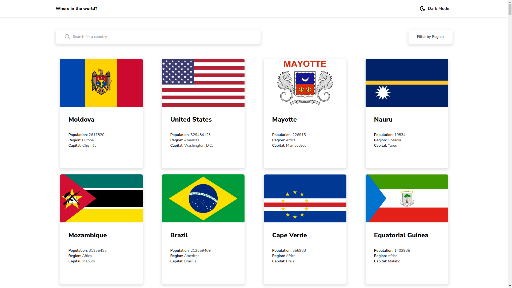
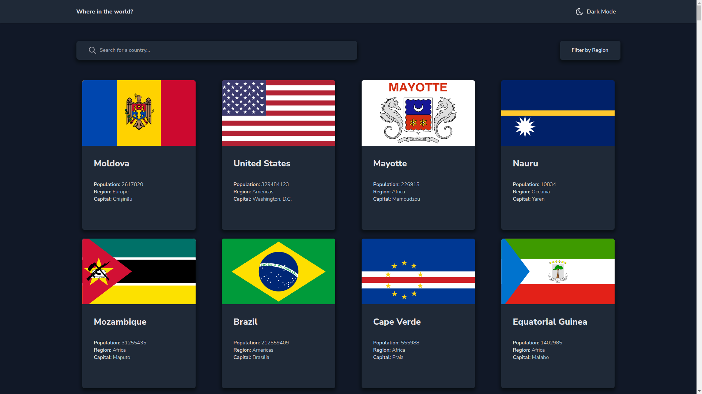

# Frontend Mentor - API REST de países com solução de alternância de tema de cores

Esta é uma solução para o [desafio da API REST de países com alternância de tema de cores no Frontend Mentor](https://www.frontendmentor.io/challenges/rest-countries-api-with-color-theme-switcher-5cacc469fec04111f7b848ca). Os desafios do Frontend Mentor ajudam você a melhorar suas habilidades de codificação através da construção de projetos realistas.

## Índice

- [Frontend Mentor - API REST de países com solução de alternância de tema de cores](#frontend-mentor---api-rest-de-países-com-solução-de-alternância-de-tema-de-cores)
  - [Índice](#índice)
  - [Visão geral](#visão-geral)
    - [O desafio](#o-desafio)
    - [Captura de tela](#captura-de-tela)
    - [Links](#links)
  - [Meu processo](#meu-processo)
    - [Construído com](#construído-com)
    - [O que eu aprendi](#o-que-eu-aprendi)
    - [Desenvolvimento contínuo](#desenvolvimento-contínuo)
  - [Autor](#autor)

## Visão geral

### O desafio

Os usuários devem ser capazes de:

- Veja todos os países da API na página inicial
- Pesquise um país usando um campo `input`
- Filtrar países por região
- Clique em um país para ver informações mais detalhadas em uma página separada
- Clique nos países fronteiriços na página de detalhes
- Alterne o esquema de cores entre o modo claro e escuro *(opcional)*

### Captura de tela

### Links

- URL da solução: https://github.com/marlissonsilva/rest-countries
- URL do site ativo: https://rest-countries-wine-two.vercel.app/

## Meu processo

### Construído com

- Semantic HTML5 markup
- Flexbox
- Mobile-first workflow
- [React](https://reactjs.org/) - JS library
- [Next.js](https://nextjs.org/) - React framework
- [TailwindCSS](https://tailwindcss.com/) - For styles

### O que eu aprendi
Fortaleci os conceitos básicos do React e Tailwind.

### Desenvolvimento contínuo
Aprender mais sobre hooks do Reack.

## Autor

- Site - [Marlisson](https://marlissonsilva.com.br/)
- Mentor de Frontend - [@marlissonsilva](https://www.frontendmentor.io/profile/marlissonsilva)

