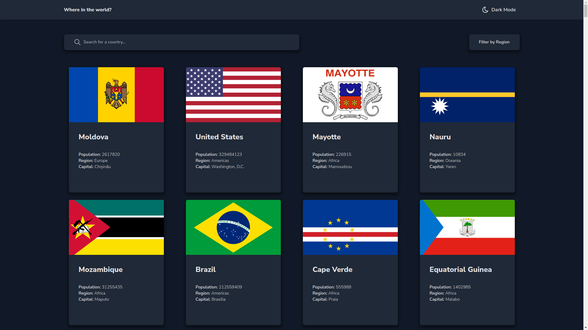

# Frontend Mentor - Countries REST API with color theme switching solution

This is a solution to the [Countries REST API challenge with color theme switching in Frontend Mentor](https://www.frontendmentor.io/challenges/rest-countries-api-with-color-theme-switcher- 5cacc469fec04111f7b848ca). Frontend Mentor challenges help you improve your coding skills by building realistic projects.

## Index

- [Frontend Mentor - Countries REST API with color theme switching solution](#frontend-mentor---countries-rest-api-with-color-theme-switching-solution)
  - [Index](#index)
  - [Overview](#overview)
    - [The challenge](#the-challenge)
    - [Print Screen](#print-screen)
    - [Links](#links)
  - [My process](#my-process)
    - [Built with](#built-with)
    - [What I've learned](#what-ive-learned)
    - [Continuous development](#continuous-development)
  - [Author](#author)

## Overview

### The challenge

Users must be able to:

- See all API countries on the home page
- Search for a country using an `input` field
- Filter countries by region
- Click on a country to see more detailed information on a separate page
- Click on the bordering countries on the details page
- Switch color scheme between light and dark mode *(optional)*

### Print Screen

### Links

- Solution URL: https://github.com/marlissonsilva/rest-countries
- Active website URL: https://rest-countries-wine-two.vercel.app/

## My process

### Built with

- Semantic HTML5 markup
-Flexbox
- Mobile-first workflow
- [React](https://reactjs.org/) - JS library
- [Next.js](https://nextjs.org/) - React framework
- [TailwindCSS](https://tailwindcss.com/) - For styles

### What I've learned
I strengthened the basic concepts of React and Tailwind.

### Continuous development
Learn more about Reack hooks.

## Author

- Website - [Marlisson](https://marlissonsilva.com.br/)
- Frontend Mentor - [@marlissonsilva](https://www.frontendmentor.io/profile/marlissonsilva)